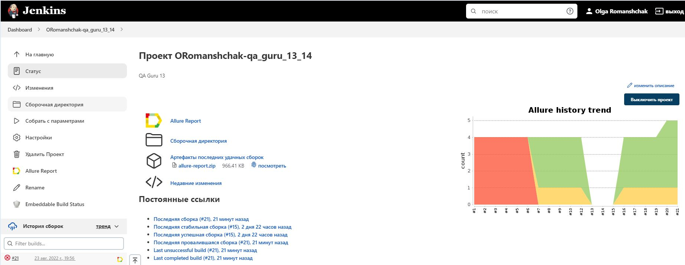
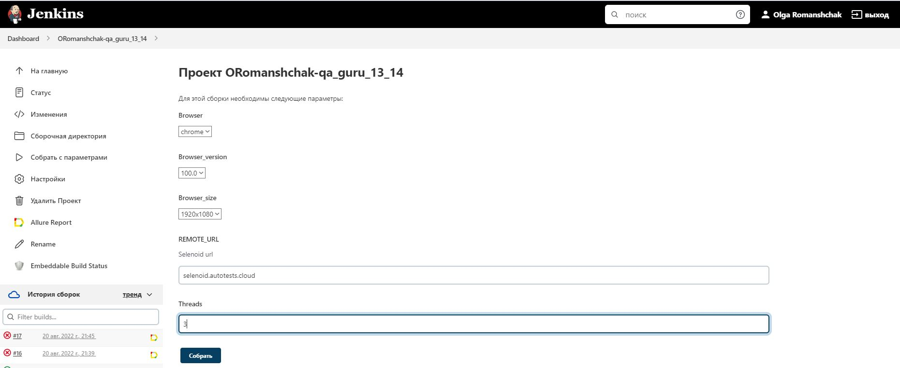
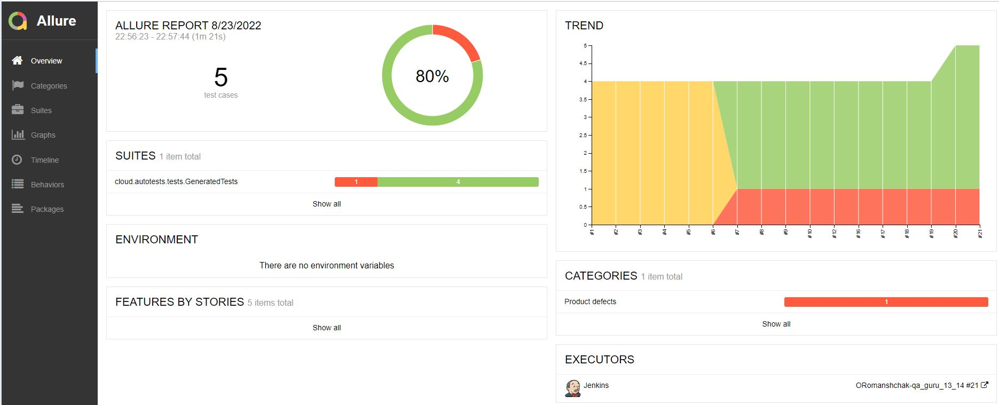
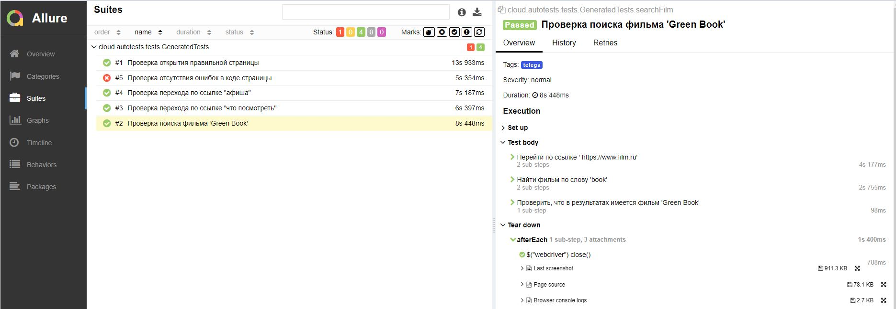
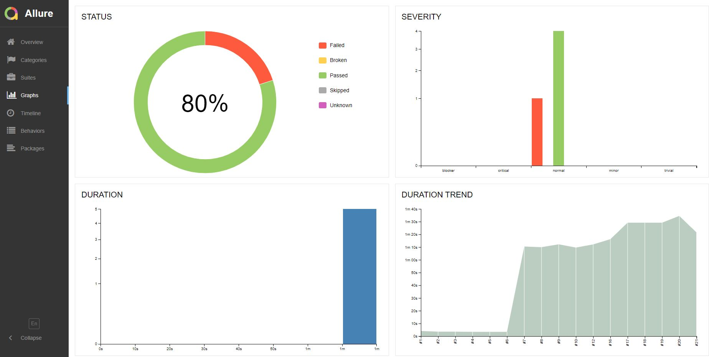
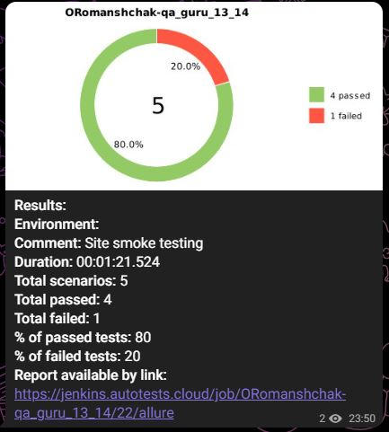

# Автоматизированное тестирование на примере работы с сайтом 'https://www.film.ru'
## :bookmark_tabs: Содержание:
:radio_button: [***Используемые технологии***](#computer-brain-Используемые-технологии)

:radio_button: [***Список проверок***](#heavy_check_mark-Список-проверок)

:radio_button: [***Команды запуска тестов***](#heavy_check_mark-Команды-запуска-тестов)

:radio_button: [***Сборка в Jenkins***](#heavy_check_mark-Сборка-в-Jenkins-с-параметрами)

:radio_button: [***Allure отчет***](#heavy_check_mark-Allure-отчет)

:radio_button: [***Отчет о прохождении тестов в Telegram***](#heavy_check_mark-Отчет-о-прохождении-тестов-в-Telegram)

:radio_button: [***Видео прохождения тестов***](#heavy_check_mark-Видео-прохождения-тестов)


## :computer: :brain: **Используемые технологии**

<div align="center">
<a href="https://www.jetbrains.com/idea/"></a>
<a href="https://www.java.com/"></a>
<a href="https://junit.org/junit5/"></a>
<a href="https://selenide.org/"></a>
<a href="https://aerokube.com/selenoid/"></a>
<a href="https://gradle.org/"></a>
<a href="https://www.jenkins.io/"></a>
<a href="https://github.com/allure-framework/"></a>
<a href="https://github.com/"></a>
<a href="https://telegram.org/"></a>
</div>


## :heavy_check_mark: **Список проверок**

* #### Проверка перехода на заданную страницу
* #### Проверка поиска заданного фильма
* #### Проверка перехода по ссылке "афиша"
* #### Проверка перехода по ссылке "что посмотреть"
* #### Проверка наличия ошибок в консоли


## :heavy_check_mark: **Команды запуска тестов**

Команда для запуска тестов локально:
```bash
gradle clean telega
```

Для запуска тестов удаленным путем используются настраиваемые параметры в Jenkins:
```bash
clean 
telega
-DremoteURL=${REMOTE_URL}
-Dbrowser=${Browser}
-DbrowserVersion=${Browser_version}
-DbrowserSize=${Browser_size}
-DremoteDriverUrl=https://user1:1234@${REMOTE_URL}/wd/hub/
-DvideoStorage=https://${REMOTE_URL}/video/
-Dthreads=${threads}
```


## :heavy_check_mark: **Сборка в Jenkins с параметрами**

<p> Сборка в <a target="_blank" href="https://jenkins.autotests.cloud/job/ORomanshchak-qa_guru_13_14/">Jenkins</a>
</p>

Скриншот показывает количество запусков данной сборки и общий тренд прохождения тестов.
<p align="center">   </p>

Скриншот показывает необходимые параметры для запуска сборки.
<p align="center">
  
</p>

## Параметры тестов:
* Browser (браузер, по умолчанию chrome)
* Browser_version (версия браузера, по умолчанию 100.0)
* Browser_size (размер окна браузера, по умолчанию 1920x1080)
* REMOTE_URL (логин, пароль и адрес удаленного сервера Selenoid)
* VIDEO_STORAGE (адрес, по которому можно получить видео)
* Проверка поиска заданного фильма


## :heavy_check_mark: **Allure отчет**

<p> Отчет в <a target="_blank" href="https://jenkins.autotests.cloud/job/ORomanshchak-qa_guru_13_14/allure/">Allure</a>
</p>

Скриншот показывает статистику последней сборки и общий тренд прохождения тестов.
<p align="center">
  
</p>

Скриншот показывает статус тестов и детали по одному из тестов (выполненные шаги, артефакты прохождения теста).
<p align="center">
  
</p>

Графики позволяют представить статистику прохождения тестов, включая важные метрики Status, Severity, Duration
<p align="center">
  
</p>


## :heavy_check_mark: **Отчет о прохождении тестов в Telegram**

Скриншот отчета о прохождении тестов, отправляемый в Telegram специально созданным ботом.
<p align="center">
  
</p>


## :heavy_check_mark: **Видео прохождения тестов**

Ссылка на пример с видео прохождения одного из тестов.
<p> Видео прохождения теста в <a target="_blank" href="https://jenkins.autotests.cloud/job/ORomanshchak-qa_guru_13_14/allure/data/attachments/1ab037f83eb2b89f.mp4">Selenoid</a></p>

